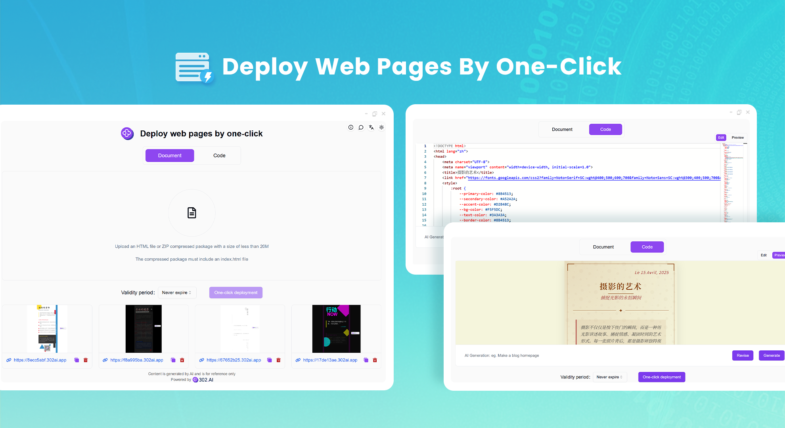
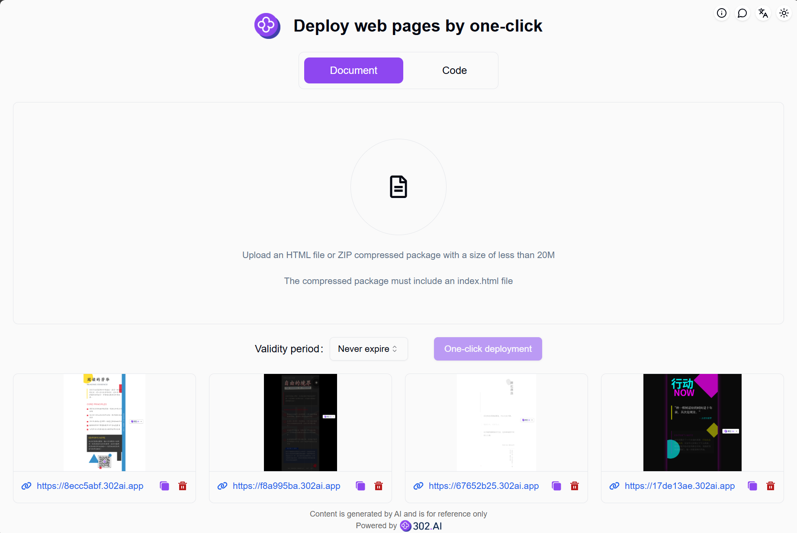
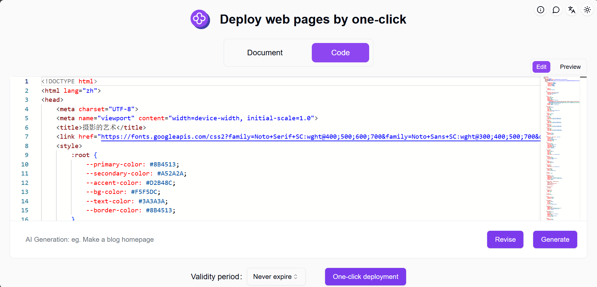
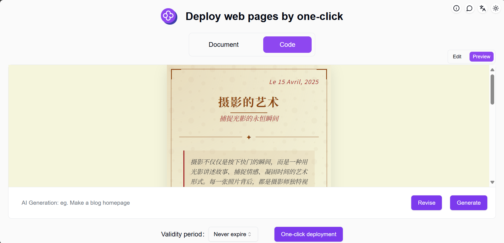

# <p align="center"> 🌐 Deploy web pages by one-click 🚀✨</p>

<p align="center">Deploy web pages by one-click enables you to host static web pages on the platform through one-click deployment, supporting both single HTML file and ZIP package deployment.</p>

<p align="center"><a href="https://302.ai/en/tools/webserve/" target="blank"></a></p >

<p align="center"><a href="README_zh.md">中文</a> | <a href="README.md">English</a> | <a href="README_ja.md">日本語</a></p>



This is the open-source version of the [Deploy web pages by one-click](https://302.ai/en/tools/webserve/) from [302.AI](https://302.ai/en/). You can directly log in to 302.AI to use the online version with zero code and zero background, or modify and deploy it yourself according to your requirements.

## Interface Preview
File upload feature allows you to upload an HTML file or ZIP package to deploy static web pages with one click. Supports setting webpage expiration date for automatic offline removal.


Code paste feature allows you to paste code here or use AI to generate code, supporting editing and real-time preview.
           

This is the real-time preview effect.
        

This is the successful webpage deployment effect.
      

## Project Features
### 📤 One-click Deployment
Supports quick deployment of HTML files and ZIP packages.
### ⏱️ Expiration Settings
Flexible settings for webpage online duration with automatic offline removal upon expiration.
### 🔄 Real-time Preview
Supports real-time preview during code editing.
### 📝 AI Code Generation
Built-in AI-assisted HTML code generation feature.
### 🌍 Multi-language Support
- Chinese Interface
- English Interface
- Japanese Interface

## 🚩 Future Update Plans
- [ ] Add webpage templates

## 🛠️ Tech Stack

- **Framework**: Next.js 14
- **Language**: TypeScript
- **Styling**: TailwindCSS
- **UI Components**: Radix UI
- **State Management**: Jotai
- **Form Handling**: React Hook Form
- **HTTP Client**: ky
- **i18n**: next-intl
- **Theming**: next-themes
- **Code Standards**: ESLint, Prettier
- **Commit Standards**: Husky, Commitlint

## Development & Deployment
1. Clone the project
```bash
git clone https://github.com/302ai/302_deploy_web_pages_by_one_click
cd 302_deploy_web_pages_by_one_click
```

2. Install dependencies
```bash
pnpm install
```

3. Configure environment
```bash
cp .env.example .env.local
```
Modify the environment variables in `.env.local` as needed.

4. Start development server
```bash
pnpm dev
```

5. Build for production
```bash
pnpm build
pnpm start
```

## ✨ About 302.AI ✨
[302.AI](https://302.ai/en/) is an enterprise-oriented AI application platform that offers pay-as-you-go services, ready-to-use solutions, and an open-source ecosystem.✨
1. 🧠 Comprehensive AI capabilities: Incorporates the latest in language, image, audio, and video models from leading AI brands.
2. 🚀 Advanced application development: We build genuine AI products, not just simple chatbots.
3. 💰 No monthly fees: All features are pay-per-use, fully accessible, ensuring low entry barriers with high potential.
4. 🛠 Powerful admin dashboard: Designed for teams and SMEs - managed by one, used by many.
5. 🔗 API access for all AI features: All tools are open-source and customizable (in progress).
6. 💡 Powerful development team: Launching 2-3 new applications weekly with daily product updates. Interested developers are welcome to contact us.